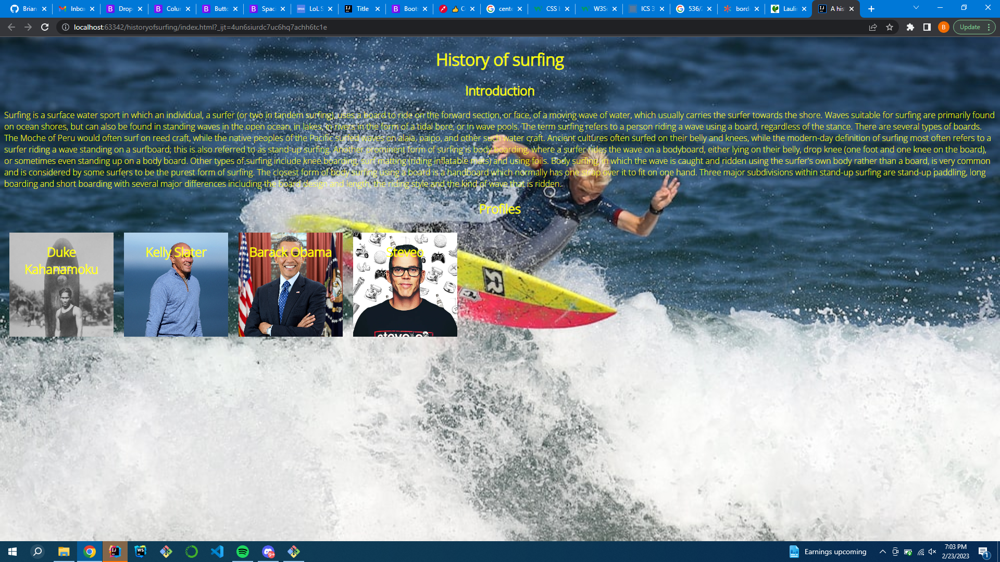
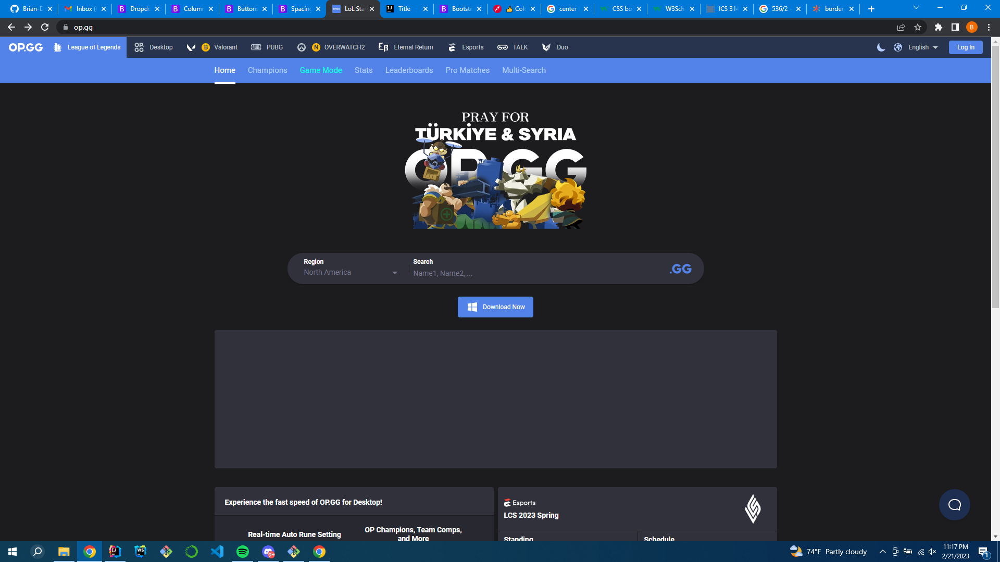

## What are frameworks?
Frameworks in web development is software that is designed to support development of web applications, using web services/resources. They also include prebuilt UI/components to utilize while also giving the programmer tools for simpler programming. There are many different flavors of frameworks which can be just as complicated as learning a new programming language, but the payoff is worth the time to learn the frameworks. 

## Bootstrap as a framework
Bootstrap is a powerful framework and a great intro to how frameworks are utilized. It offers many basic website components as well as classes to edit positioning on page elements more fluidly. However I believe that Bootstrap is merely an intro tool to frameworks in general. Frameworks such as Quasar which utilizes Vue.js offer many more components for web pages, as well as building upon the Javascript to HTML connection. However this doesn’t stop Bootstrap from being a powerful tool in website development, but it is definitely a stepping stone compared to other tools in my experience.

## Raw HTML and CSS VS. Bootstrap (Framework)

Here I will provide two website pages one with only HTML and CSS and another one with Bootstrap. Granted it is an unfair comparison in terms of appeal but that is because the HTML website has no design qualities whatsoever. Besides the sheer ugliness of the raw HTML and CSS website, the main takeaway is the amount of time it would take to create each website.

The HTML and CSS site does not take very long to replicate, but if I had to replicate the look and feel of the Bootstrap website using raw HTML and CSS it would be abysmal. This is due to the amount of stylization that must be made for each component in the op.gg website. However if we use Bootstrap to replicate the raw HTML and CSS it would actually make website development even faster. This is because it contains many tools to shape each page as well as tools such as Columns to separate each item. It also contains prebuilt classes that center each item, or even change the color of the text. When making the op.gg website as well, it removes much of the css customization because the framework provides prebuilt css classes for us to use.
