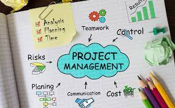

## Software Engineering
Throughout my coding career I’ve heard software developer and engineering so many times. I never truly understood the concept behind the title. The only title I did understand was programmer, but little did I know being a programmer and software engineer are the same thing. Except software engineering requires the same knowledge as a programmer, but includes many more responsibilities such as understanding and applying Design Patterns, coding standards, and agile project management. Being a software engineer requires knowledge on many different tools other than learning how to code and write programs. Although these patterns doesn’t showcase software engineering completely, it showcases very key components of being a software engineer.

### Design Patterns
A Design Pattern “describes a problem that occurs over and over again in our environment, and then describes the core of the solution to that problem, in such a way that you can use this solution a million times over, without ever doing it the same way twice” (Christopher Alexander, 1977). When working on large scale projects we often run into difficulties such as lack of communication and or cohesion. Teammates may often write programs that are completely unreadable, however with the use of set design patterns we can avoid such mistakes. As christopher Alexander describes above, Design patterns are patterns. When we recognize this idea we can utilize the best methods to approach said patterns to keep code consistent and effective. This taught me that many coding ideas already have set conventions. We do not need to reinvent the wheel. Being able to recognize the situations for patterns allow us to complete projects more smoothly and keep sections of code consistent for whoever is on the project making it easier to understand.

### Coding Standards
Coding standards are basic programing rules that developers create on the project. This is similar to Design Patterns in which it creates consistency and simplicity throughout the code. If everyone follows similar rules, such as consistent spacing, and variable naming it allows teammates on your project to write clean code. So you can avoid deciphering their hieroglyphs. However not every coding standard will meet your own standard as these are agreed upon rules that not everyone will like. Even so, they must still be enforced to mitigate possible spaghetti code.

### Agile Project Management
Agile project management is an idea to set rules and time frames to develop and deliver a project. One of the most important skills I have learned in this class. It involves creating Fixed-length iterations/releases, delivering business value early, Continuous, adaptive planning, and continuous testing. When working on projects, following a guideline to deliver items is important. Instead of waiting around for items to be completed, agile project management forces you to deliver items consistently and within a manageable timeframe. It is important to also understand the scale of which you should plan varies from project to project. As it depends on tasks and the people you are working with. 
