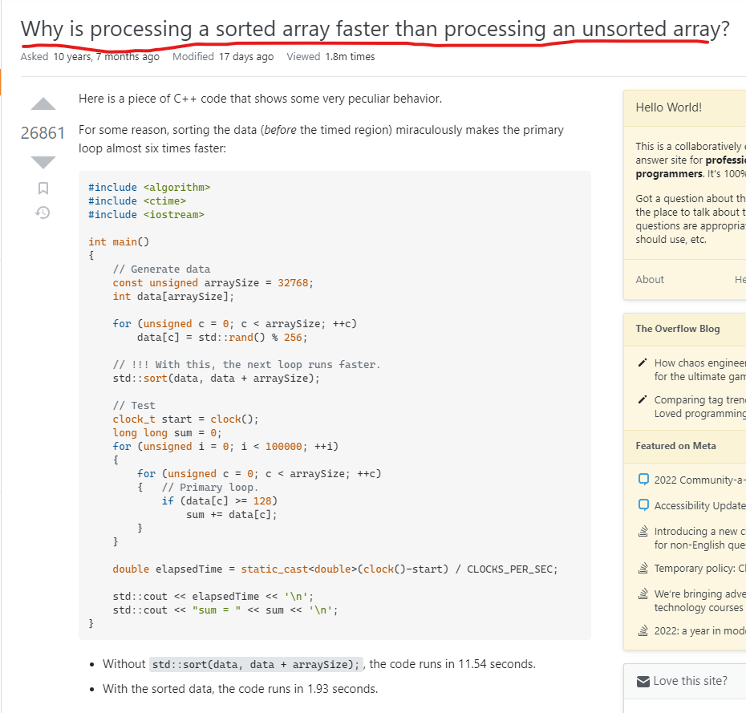

StackOverflow is known as a developer’s best friend. Whenever you run into specific coding problems, StackOverflow would usually have an answer. Interestingly enough many developers also never have to ask questions, but when they do many developers may not understand how to ask. In this essay we will talk about **bad questions** and **smart questions**.

## What’s a bad question?

Bad questions are easy to ask. If you don’t take the time to expand upon your problems you can  easily ask a low detailed question which often gets ignored. An easy way to ask a bad question is by “guessing” issues instead of “describing” the symptoms of your problem. Bad questions also lack explicitly, as I stated earlier. Bad questions often contain low detail and aren’t explained well enough to help the reader understand your problem/question. It also makes it less appealing to help, as you have little to no information to build off of.

An example of such a bad question can be found below: **(source: https://stackoverflow.com/q/75254842)**

In this example we see that there is little to no detail. The user even mentions Gitlab which is another form of version control similar to Github. This means that the user should be able to post their repository for easier viewing. Another issue is their question. The user asks what is the “Best practice to save input data files used for Unit Testing.” This is a bad question because they refused to elaborate on what type of unit testing is done. Unit testing can take many different forms and are used depending on the application and situation. The user fails to elaborate on what they were testing, which makes it more difficult as the reader to understand what would be the most effective solution.

## What's a smart question?

Smart questions on the other hand are a lot harder to ask as they require more time to develop. To ask smart questions first begins with being detailed in your problem/question. Explain the symptoms of your problem, and showcase code that is necessary and tied to the area you’re trying to solve/fix. Adding this level of detail to your question creates a more inviting question, which leads to more help. 

An example of smart question can be seen below: **(source: https://stackoverflow.com/q/11227809)**

  
  
  

This is a smart question because the user provided a clear question and examples of the code. The user also provides the time it takes to run said code. The user ends the post with related/follow-up questions for readers to check out, which provides the reader more information about the problem at hand. The question was also clear and isn’t flooded with assumptions about the process and code. It was both detailed, and concise.

## Conclusion

Looking at both questions we can also see the amount of traction each question received. The bad question received 0 comments and -1 likes, while the smart question received 26861 likes and many comments. When you can’t find a solution to your problem, and your last resort is StackOverflow, then you should take the time to develop smarter questions and to add in the necessary details to help the reader understand. It will have a more likely chance of a reader responding and being helpful.
