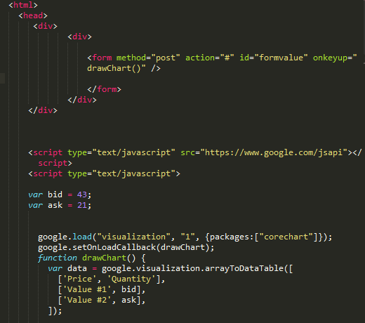

<!-- 

## Early life before college
In my early life I was consistently influenced by the digital world. Playing video games on a daily basis, while interacting with the internet and watching videos. The digital realm was a large part of my life, although we grew up poor, I was constantly around technology. I however never considered a field within software engineering until a fateful day in High school. 

I accidentally took a class called STEM, which introduced  me to HTML, CSS, & Javascript. Playing and fiddling around with code in class made me realize that coding was so much more than just typing magic words onto a screen. It required constant problem solving, cognitive, and imaginative thinking. 

Coding seemed endless and in class we would consistently code athletically and create small websites that utilizes complex Javascript algorithms. This sparked an even larger interest within software engineering as I continued to develop with age. I realized that problem solving was unbelievably fluid within the coding field and with my ever growing interest with the world and environment, I also realized that coding and software development can be found in almost every field I found intriguing.

## Life during college
Going through college opened my eyes to the development world. As an ignorant high schooler I believe that I was more than prepared for the vas world of coding, but as I trekked through each class and requirement, I became less and less ignorant to the tools and programs around me. 

Each class, although repeating the same fundamentals of coding, offered something new. I learned of different IDEs, frameworks, coding strategies, and problem solving techniques. This made coding even more intimidating and interesting than I already saw it, but it never deterred me from my path. Coding was a large combination of many passions and interests in my life.

Also being apart of such a large community for programming at the university level allows me to join clubs and interact with my peers. One of the clubs I actively took part in recently was Pandas. A club that trains students and prepares them for coding interviews by providing coding problems that we must solve. As we slice through each problem the next problem also increases in difficulty and complexity. 

The club made me realize that certain fields within the programming world must have complex problem solvers. Although many jobs don’t require this type of problem solving on a daily basis, if I were to ever code anything that involves human lives, the complexity of the code and correctness must matter to me.

## What my future holds for me
Reflecting on everything I have been through and learned on my journey makes me think that I made the right decision on the profession I wanted to master. However, even after all this time I am still figuring out which direction I want to branch off into. With recent creations such as Midjourney AI and ChatGPT it makes me wonder if I should begin leaning into neural networks and machine learning to hopefully aid in propelling the world forward into a technological renaissance. 

As I continue growing and learning I’m sure a decision as significant as job choice will become easier and easier. As of right now, I believe I’ll continue being open minded to the different fields and careers that programming affects.

## Atheletic software engineering and WODs!

I found athletic software engineering fun and useful. The WODs are like algorithm problems, where we have to use our knowledge of Javascript to solve simple coding problems. I think this style of learning is hands-on because we have to code the solutions ourselves. The WODs are also not stressful. I do not believe they should be stressful as they are just fun challenges to prepare us for the actual test. Athletic software engineering is a strong in its use because what certain programming classes lack are these classroom interactions and brain scratchers. Many classes in college often have professors ramble and speak to you instead of you interacting with the class itself. It makes a lot of people lose interest in the material they learn, but when we are forced to code and solve problems it keeps us engaged with the class, which is why athletic software engineering is a strong tool.
