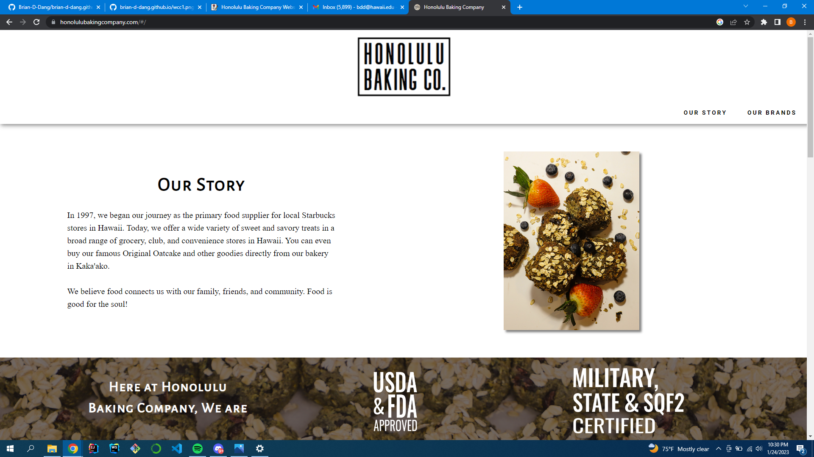

  

**PROJECT Website: https://honolulubakingcompany.com/#/**

**Github Repository: https://github.com/Roosevelt-High-School-STEM-program/Roosevelt-Website-Project"**

## What is the project 

The Honolulu Baking Company did not have a website to advertise their mission and food, so I was tasked with a project to create a website from scratch for the Honolulu Baking Company. Utilizing Vue.js and Quasar and git I created tasks and went through the process of self pr reviews. I also had to practice communicating with the client to decipher what the final product would look like, and how they want to showcase their company. 

## What I found challenging

I underestimated the length of website projects. Coding from scratch and producing the website as a sole developer was taxing. I didn’t place enough time into website creation and almost fell short of the website release deadline. I placed too much emphasis on mobile conversion. The website had been optimized for PC early into development, but mobile capabilities weren’t fully developed. So instead of releasing the website I began mobile conversion.

Although I finished the project on time, I learned that I should have released the website before moving onto mobile conversion. This is so the clients themselves wouldn’t have to worry about the website and are able to expand on the web. This also provides me with leg room to continue development without worrying about the website deadline. I also learned to place more time into web development projects. 

## Tools used for this project
**- Vue.js - Quasar Framework**

