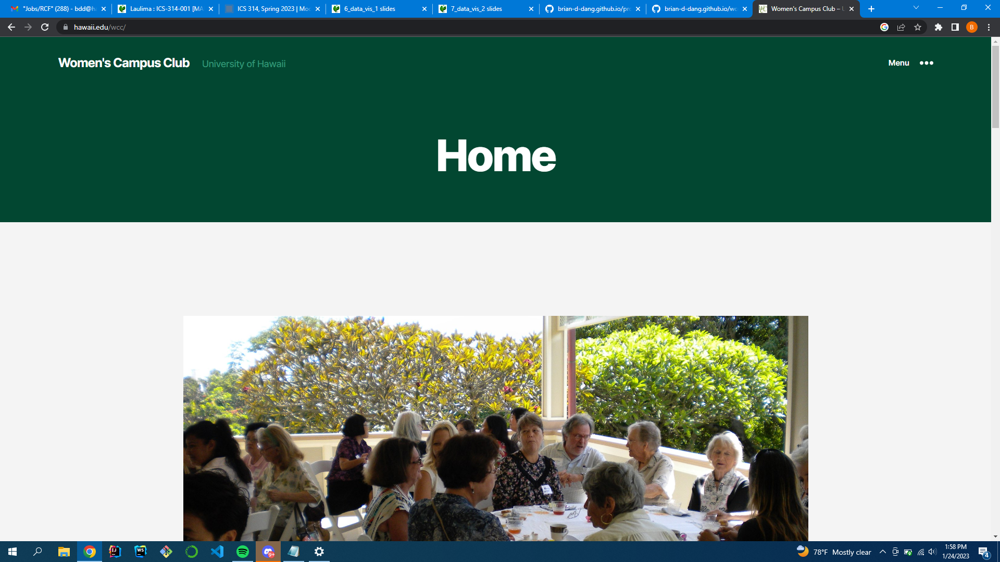
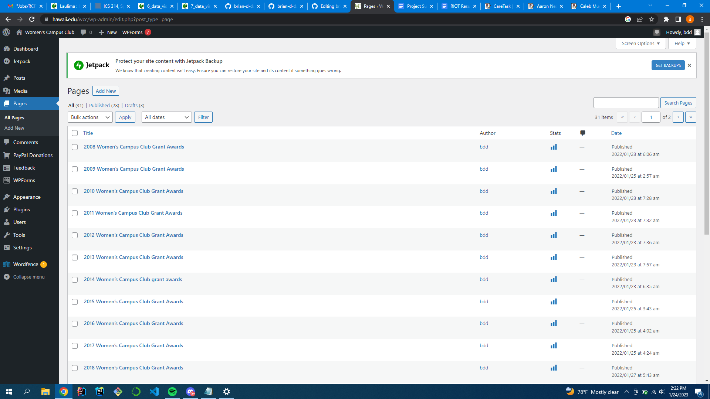

  
  
  

## What is the project
The Women’s Campus Club required help revamping their old website. Utilizing UH ITS utilities I was able to update the website from basic HTML and CSS to wordpress. The Women’s Campus Club is an organization that can be found on campus at their Thrift Store location. The project required me to work through graphic design concepts and learning wordpress. This introduced me to content management systems and allowed me to practice communicating with clients. 

## What I found challenging
I found creating a new application with wordpress was intimidating. Although wordpress was an application used by many, and was considered simple, I was working on the project alone with no help to fall back on. I had to figure out how to traverse the workspace and also graphically design a website with little to no design experience. However, with enough determination to jump over the first hurdle, starting the project, I was able to steamroll through each page one by one. 

## Tools used for this project
**- Wordpress**
**- Filezilla**

